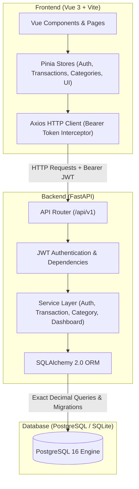
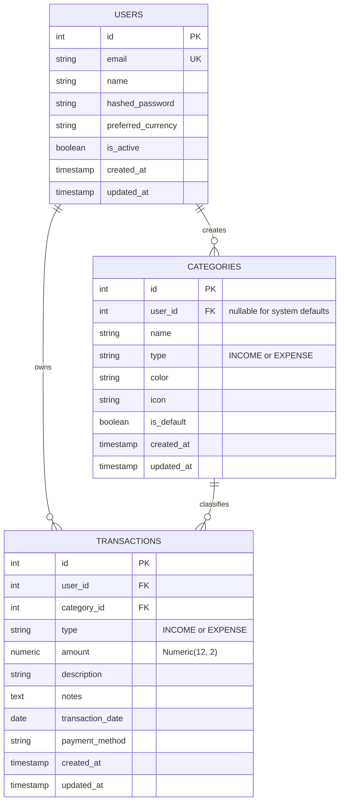

# 📊 Expense Tracker Dashboard

> A modern, full-stack personal finance web application and SaaS-style dashboard built with **Vue 3**, **FastAPI**, and **PostgreSQL**. Engineered for tracking income and expenses, organizing transactions into categories, analyzing monthly spending trends, and visualizing financial health through interactive charts.

---

## 🎯 Project Overview & Objectives

**Expense Tracker Dashboard** is designed to demonstrate professional full-stack software engineering practices:
1. **Interactive SaaS UI/UX**: Clean, responsive dashboard layout with dark/light themes, collapsible navigation, modal dialogs, and dynamic financial charts.
2. **Robust Backend API**: High-performance RESTful API built with Python 3.11 and FastAPI, featuring strict Pydantic v2 validation and structured OpenAPI documentation.
3. **Database Architecture & Migrations**: Relational schema managed by SQLAlchemy 2.0 ORM with versioned Alembic database migrations.
4. **Exact Decimal Precision**: All monetary values utilize Python `Decimal` and SQL `Numeric(12, 2)` to eliminate IEEE 754 floating-point rounding errors.
5. **Multi-Tenant Security**: JWT-based authentication, bcrypt password hashing, and user-scoped data queries ensuring complete isolation between users.
6. **Production & Containerization Ready**: Automated Docker Compose configuration, comprehensive pytest backend test suite, and Vitest frontend unit test suite.

---

## 🛠️ Technology Stack

| Layer | Technology | Justification & Role |
| :--- | :--- | :--- |
| **Frontend Framework** | **Vue 3** (Composition API) | Modern, reactive UI with `<script setup>` syntax for readable and maintainable components |
| **Build Tool** | **Vite** | Fast Hot Module Replacement (HMR) and optimized rollup production bundles |
| **State Management** | **Pinia** | Type-safe, modular state management for authentication, transactions, and UI themes |
| **Routing** | **Vue Router 4** | Client-side routing with navigation guards for protected dashboard routes |
| **Visualizations** | **Chart.js & Vue-Chartjs** | Reactive canvas-based data visualizations (Bar, Doughnut, and Line charts) |
| **HTTP Client** | **Axios** | Centralized client with request interceptors for JWT Bearer tokens and 401 handling |
| **Backend Framework** | **FastAPI** (Python 3.11) | Asynchronous, high-performance REST framework with automatic OpenAPI documentation |
| **Validation** | **Pydantic v2** | Strict schema validation for request payloads, query parameters, and responses |
| **ORM & Migrations** | **SQLAlchemy 2.0 & Alembic** | Clean database modeling with foreign keys, indexes, cascades, and tracked migrations |
| **Database** | **PostgreSQL 16** (or SQLite local) | ACID-compliant relational storage with exact numeric precision and volume persistence |
| **Security** | **Bcrypt & Python-Jose** | Cryptographic password hashing (auto-salted) and signed JWT tokens |
| **DevOps & Containers** | **Docker & Docker Compose** | Multi-stage production container builds and local development orchestration |
| **Automated Testing** | **Pytest & Vitest** | Automated backend unit/integration tests and frontend component tests |

---

## 🏗️ System Architecture & Data Flow



### Data Flow Lifecycle (Adding a Transaction):
1. User clicks **"New Transaction"**; `TransactionForm.vue` opens in a modal dialog.
2. User selects **Type** (`EXPENSE`), enters **Amount** (`$85.50`), picks **Category** (`Groceries`), enters description, and submits.
3. Client validates that amount is positive and required fields are populated.
4. `stores/transactions.js` dispatches `POST /api/v1/transactions` with the Bearer JWT token attached.
5. FastAPI verifies the JWT token, extracts `current_user.id`, and validates the schema using Pydantic.
6. `TransactionService` verifies category ownership/default access, ensures category type matches transaction type, and commits a new `Transaction` record using `Numeric(12, 2)`.
7. Frontend receives the response, updates the reactive table, and refreshes the dashboard summary cards and charts.

---

## 🗄️ Database Schema & Relational Design



### Safe Category Deletion Rule:
- System default categories (`user_id = NULL`) **cannot be deleted or modified**.
- Custom categories **cannot be deleted if transactions reference them**. The API rejects deletion with HTTP 400 Bad Request, instructing the user to reassign or delete the associated transactions first.

---

## 📂 Project Structure

```text
TrackExpense/
├── .env.example                     # Environment variables template (placeholders only)
├── .gitignore                       # Ignored files (secrets, virtualenv, node_modules, caches)
├── docker-compose.yml               # Multi-container orchestration (DB, Backend, Frontend)
├── README.md                        # Project documentation & portfolio guide
│
├── backend/                         # FastAPI Backend
│   ├── Dockerfile                   # Python 3.11 slim container build
│   ├── .dockerignore                # Excluded container files
│   ├── requirements.txt             # Python dependencies
│   ├── pytest.ini                   # Pytest configuration
│   ├── alembic.ini                  # Alembic migration configuration
│   ├── alembic/                     # Database migration scripts & history
│   │   ├── env.py
│   │   └── versions/
│   ├── app/
│   │   ├── main.py                  # FastAPI application entrypoint & lifespan
│   │   ├── core/                    # Security, JWT, and settings
│   │   │   ├── config.py
│   │   │   ├── security.py
│   │   │   └── dependencies.py
│   │   ├── db/                      # Database engine, sessionmaker, and seeders
│   │   │   ├── base.py
│   │   │   ├── session.py
│   │   │   ├── init_db.py
│   │   │   └── seed.py
│   │   ├── models/                  # SQLAlchemy 2.0 models (User, Category, Transaction)
│   │   ├── schemas/                 # Pydantic v2 validation schemas
│   │   ├── services/                # Business logic & calculation services
│   │   └── api/v1/                  # REST API v1 endpoints
│   └── tests/                       # Pytest test suite (18 tests, 100% pass)
│       ├── conftest.py
│       ├── test_auth.py
│       ├── test_categories.py
│       ├── test_transactions.py
│       ├── test_user_isolation.py
│       └── test_dashboard.py
│
└── frontend/                        # Vue 3 Frontend
    ├── Dockerfile                   # Multi-stage production container build (Node + Nginx)
    ├── .dockerignore
    ├── nginx.conf                   # Nginx reverse proxy & SPA history routing
    ├── package.json                 # Dependencies & scripts
    ├── vite.config.js               # Vite config with Vitest & alias
    ├── index.html                   # HTML5 shell with Google Fonts
    ├── src/
    │   ├── main.js                  # App mount with Pinia & Router
    │   ├── App.vue                  # Root component
    │   ├── assets/styles/           # Design system CSS variables & reset
    │   ├── components/
    │   │   ├── common/              # Navbar, Sidebar, StatCard, Modal, ConfirmDialog
    │   │   ├── dashboard/           # RecentTransactions widget
    │   │   ├── transactions/        # TransactionForm, Filters, List table
    │   │   ├── categories/          # CategoryModal
    │   │   └── charts/              # IncomeExpenseChart, CategoryDonutChart, SpendingTrend
    │   ├── layouts/                 # AppLayout (SaaS layout) & AuthLayout
    │   ├── pages/                   # Dashboard, Transactions, Categories, Reports, Settings, Auth
    │   ├── router/                  # Vue Router with navigation guards
    │   ├── stores/                  # Pinia stores (Auth, Transactions, Categories, UI)
    │   ├── services/                # Axios API client & endpoints
    │   └── utils/                   # Currency, date, and percentage formatters
    └── tests/                       # Vitest test suite (14 tests, 100% pass)
        ├── unit/
        └── components/
```

---

## 🧮 Financial Calculations & Formulas

All monetary figures are calculated on the backend using Python's exact `Decimal` arithmetic:

1. **Total Income & Total Expenses**:
   $$\text{Total Income} = \sum_{\text{INCOME}} \text{Amount}$$
   $$\text{Total Expenses} = \sum_{\text{EXPENSE}} \text{Amount}$$

2. **Net Remaining Balance**:
   $$\text{Net Balance} = \text{Total Income} - \text{Total Expenses}$$

3. **Savings Rate**:
   $$\text{Savings Rate} = \begin{cases} \left(\frac{\text{Net Balance}}{\text{Total Income}}\right) \times 100 & \text{if Total Income} > 0 \text{ and Net Balance} > 0 \\ 0.0\% & \text{otherwise} \end{cases}$$

4. **Month-over-Month (MoM) Growth**:
   $$\text{Income Change \%} = \frac{\text{Current Income} - \text{Previous Income}}{\text{Previous Income}} \times 100$$
   $$\text{Expense Change \%} = \frac{\text{Current Expense} - \text{Previous Expense}}{\text{Previous Expense}} \times 100$$

---

## 📡 API Endpoints Overview

| Method | Endpoint | Description | Auth Required |
| :--- | :--- | :--- | :---: |
| `POST` | `/api/v1/auth/register` | Register new user account | No |
| `POST` | `/api/v1/auth/login` | Authenticate and obtain JWT token | No |
| `POST` | `/api/v1/auth/logout` | Client session logout | Yes |
| `GET` | `/api/v1/auth/me` | Retrieve authenticated user profile | Yes |
| `PATCH` | `/api/v1/auth/profile` | Update user name & preferred currency | Yes |
| `GET` | `/api/v1/transactions` | Paginated list with type, category, date filters | Yes |
| `POST` | `/api/v1/transactions` | Create income or expense record | Yes |
| `GET` | `/api/v1/transactions/{id}` | Retrieve transaction detail | Yes |
| `PUT` | `/api/v1/transactions/{id}` | Update existing transaction | Yes |
| `DELETE` | `/api/v1/transactions/{id}` | Delete transaction | Yes |
| `GET` | `/api/v1/categories` | List system defaults + user custom categories | Yes |
| `POST` | `/api/v1/categories` | Create custom category | Yes |
| `PUT` | `/api/v1/categories/{id}` | Update custom category | Yes |
| `DELETE` | `/api/v1/categories/{id}` | Safe category deletion | Yes |
| `GET` | `/api/v1/dashboard/summary` | Monthly summary metrics & savings rate | Yes |
| `GET` | `/api/v1/dashboard/monthly` | 6-month income vs expenses for bar chart | Yes |
| `GET` | `/api/v1/dashboard/category-breakdown` | Expense breakdown for doughnut chart | Yes |
| `GET` | `/api/v1/dashboard/trends` | Chronological spending trend points | Yes |
| `GET` | `/api/v1/health` | Health check endpoint | No |

---

## 🚀 Getting Started Locally

### Prerequisites
- **Python**: 3.11 or higher
- **Node.js**: v18 or v20+ with `npm`
- **Git**

### 1. Clone & Setup Environment Configuration
```bash
git clone https://github.com/YOUR_USERNAME/ExpenseTrackerDashboard.git
cd ExpenseTrackerDashboard

# Copy environment template
cp .env.example .env
```

### 2. Backend Setup
```bash
# Navigate to backend directory
cd backend

# Create virtual environment
python -m venv .venv

# Activate virtual environment
# On Windows PowerShell:
.\.venv\Scripts\Activate.ps1
# On macOS / Linux:
source .venv/bin/activate

# Install dependencies
pip install -r requirements.txt

# Run database migrations
alembic upgrade head

# Seed realistic demo data
python -m app.db.seed

# Start FastAPI development server
uvicorn app.main:app --reload --port 8000
```
Backend API will be accessible at `http://localhost:8000` with interactive Swagger docs at `http://localhost:8000/api/v1/docs`.

### 3. Frontend Setup
```bash
# Open a new terminal and navigate to frontend directory
cd frontend

# Install npm dependencies
npm install

# Start Vite development server
npm run dev
```
Frontend web application will run at `http://localhost:5173`.

### 🔑 Demo Account Credentials
- **Email:** `demo@expensetracker.dev`
- **Password:** `DemoPass123!`
*(The login page also provides a one-click **"Auto-Fill Demo"** button)*

---

## 🐳 Running with Docker Compose

To run the entire application (PostgreSQL 16 + FastAPI + Vue 3 Production Build) with a single command:

```bash
docker-compose up --build
```

- **Frontend Application**: `http://localhost:5173`
- **Backend API**: `http://localhost:8000`
- **Interactive OpenAPI Documentation**: `http://localhost:8000/api/v1/docs`

To stop containers:
```bash
docker-compose down
```

---

## 🧪 Automated Testing

### Backend Tests (pytest)
Runs 18 automated tests covering authentication, password hashing, transaction validations, multi-tenant isolation, and dashboard financial math:
```bash
cd backend
.\.venv\Scripts\pytest -v
```

### Frontend Tests (Vitest)
Runs 14 automated unit and component tests verifying formatters, Pinia store state, StatCards, and form validation:
```bash
cd frontend
npm run test
```

### Production Build Verification
```bash
cd frontend
npm run build
```

---

## 🔒 Security & Privacy Implementation

- **Bcrypt Password Hashing**: Passwords are never stored in plaintext and hashed with individual cryptographic salts.
- **JWT Authorization**: Requests to protected routes require a signed `Bearer <token>` in the HTTP `Authorization` header.
- **Strict Multi-Tenant Scoping**: All database queries for transactions and dashboard summaries enforce `WHERE user_id = current_user.id`.
- **CORS Protection**: CORS middleware is restricted to designated frontend origins.
- **Secret Protection**: `.env` and local databases are strictly excluded by `.gitignore`.

---

## 💡 Technical Interview Talking Points

1. **Why `Decimal` instead of `Float`?**
   Binary floating-point arithmetic (IEEE 754) suffers from imprecise representations (e.g. `0.1 + 0.2 = 0.30000000000000004`). In financial applications, this leads to accounting drift. Using Python's `Decimal` and SQL `Numeric(12, 2)` guarantees exact decimal arithmetic.

2. **How is Multi-Tenancy Enforced?**
   Rather than trusting client-provided `user_id` query parameters, the backend extracts the verified user identity directly from the decoded cryptographically signed JWT payload in `get_current_user`. Every service query automatically filters records by `user_id == current_user.id`.

3. **How does safe category deletion work?**
   Categories can be shared defaults or custom user categories. System defaults cannot be deleted. Custom categories run an integrity check against the `transactions` table before deletion; if transactions exist, the deletion is aborted with an actionable error.

---

## 📄 License
This project is open-source under the [MIT License](LICENSE).
