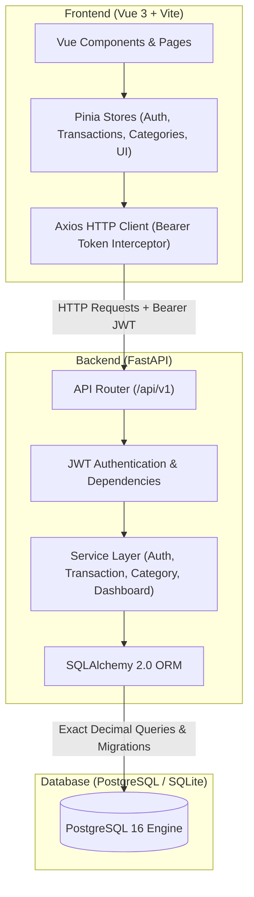

# 📊 Expense Tracker Dashboard

> A modern, full-stack personal finance web application and SaaS-style dashboard built with **Vue 3**, **FastAPI**, and **PostgreSQL**. Engineered for tracking income and expenses, organizing transactions into categories, analyzing monthly spending trends, and visualizing financial health through interactive charts.

---

## 🎯 Project Overview & Objectives

**Expense Tracker Dashboard** is designed to demonstrate professional full-stack software engineering practices:
1. **Interactive SaaS UI/UX**: Clean, responsive dashboard layout with dark/light themes, collapsible navigation, modal dialogs, and dynamic financial charts.
2. **Robust Backend API**: High-performance RESTful API built with Python 3.11 and FastAPI, featuring strict Pydantic v2 validation and structured OpenAPI documentation.
3. **Database Architecture & Migrations**: Relational schema managed by SQLAlchemy 2.0 ORM with versioned Alembic database migrations.
4. **Exact Decimal Precision**: All monetary values utilize Python `Decimal` and SQL `Numeric(12, 2)` to eliminate IEEE 754 floating-point rounding errors.
5. **Multi-Tenant Security**: JWT-based authentication, bcrypt password hashing, and user-scoped data queries ensuring complete isolation between users.
6. **Production & Containerization Ready**: Automated Docker Compose configuration, comprehensive pytest backend test suite, and Vitest frontend unit test suite.

---

## 🛠️ Technology Stack

| Layer | Technology | Justification & Role |
| :--- | :--- | :--- |
| **Frontend Framework** | **Vue 3** (Composition API) | Modern, reactive UI with `<script setup>` syntax for readable and maintainable components |
| **Build Tool** | **Vite** | Fast Hot Module Replacement (HMR) and optimized rollup production bundles |
| **State Management** | **Pinia** | Type-safe, modular state management for authentication, transactions, and UI themes |
| **Routing** | **Vue Router 4** | Client-side routing with navigation guards for protected dashboard routes |
| **Visualizations** | **Chart.js & Vue-Chartjs** | Reactive canvas-based data visualizations (Bar, Doughnut, and Line charts) |
| **HTTP Client** | **Axios** | Centralized client with request interceptors for JWT Bearer tokens and 401 handling |
| **Backend Framework** | **FastAPI** (Python 3.11) | Asynchronous, high-performance REST framework with automatic OpenAPI documentation |
| **Validation** | **Pydantic v2** | Strict schema validation for request payloads, query parameters, and responses |
| **ORM & Migrations** | **SQLAlchemy 2.0 & Alembic** | Clean database modeling with foreign keys, indexes, cascades, and tracked migrations |
| **Database** | **PostgreSQL 16** (or SQLite local) | ACID-compliant relational storage with exact numeric precision and volume persistence |
| **Security** | **Bcrypt & Python-Jose** | Cryptographic password hashing (auto-salted) and signed JWT tokens |
| **DevOps & Containers** | **Docker & Docker Compose** | Multi-stage production container builds and local development orchestration |
| **Automated Testing** | **Pytest & Vitest** | Automated backend unit/integration tests and frontend component tests |

---

## 🏗️ System Architecture & Data Flow

### Data Flow Lifecycle (Adding a Transaction):
1. User clicks **"New Transaction"**; `TransactionForm.vue` opens in a modal dialog.
2. User selects **Type** (`EXPENSE`), enters **Amount** (`$85.50`), picks **Category** (`Groceries`), enters description, and submits.
3. Client validates that amount is positive and required fields are populated.
4. `stores/transactions.js` dispatches `POST /api/v1/transactions` with the Bearer JWT token attached.
5. FastAPI verifies the JWT token, extracts `current_user.id`, and validates the schema using Pydantic.
6. `TransactionService` verifies category ownership/default access, ensures category type matches transaction type, and commits a new `Transaction` record using `Numeric(12, 2)`.
7. Frontend receives the response, updates the reactive table, and refreshes the dashboard summary cards and charts.

---

## 📄 License
This project is open-source under the [MIT License](LICENSE).
